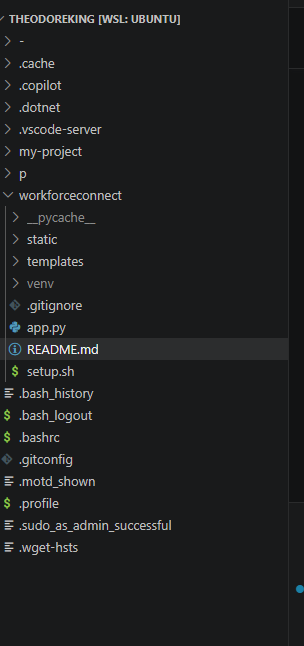
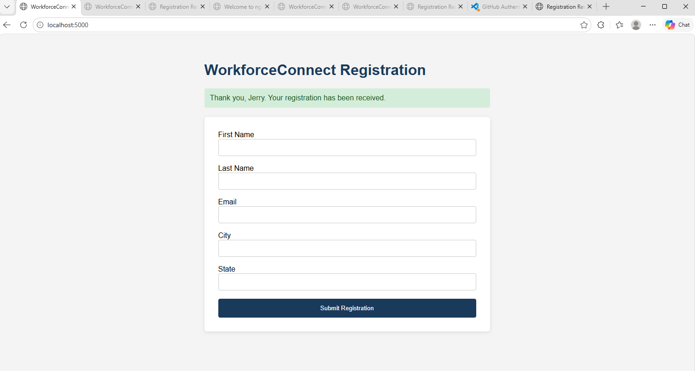
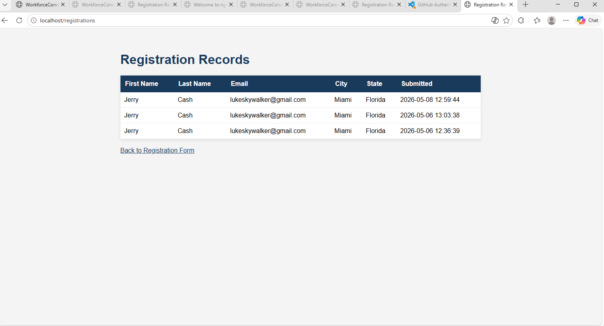
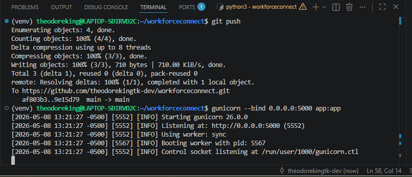

# WorkforceConnect

A production-style full-stack workforce registration application built using Python, Flask, MySQL, Gunicorn, Nginx, Ubuntu Linux (WSL), GitHub, and VS Code.

The project simulates a real-world on-premises application environment commonly used before migrating workloads into cloud infrastructure platforms such as AWS.

This application allows users to submit registration information through a live web form while storing submitted data inside a MySQL relational database. The project demonstrates full-stack connectivity between:

- Web Browser
- Nginx Reverse Proxy
- Gunicorn Application Server
- Flask Backend Application
- MySQL Database

This project was completed as part of the BCE Cloud Engineers Bootcamp Week 1 Linux & On-Premises Application Build.

---

# Project Overview

The purpose of this project was to build and understand a complete Linux-based application stack before cloud migration into AWS infrastructure environments.

The project focused heavily on:

- Linux administration
- Python web development
- MySQL database management
- Reverse proxy configuration
- Production-style application hosting
- Git/GitHub version control
- Nginx web server configuration
- Gunicorn production deployment
- Full-stack application troubleshooting

The project architecture directly mirrors the same deployment structure later used inside AWS cloud infrastructure environments.

---

# Features

## Application Features
- User registration form
- MySQL database integration
- Registration records viewer
- Live form submission handling
- Dynamic HTML rendering using Flask templates
- Timestamped registration storage
- Persistent relational database storage

## Infrastructure Features
- Reverse proxy architecture using Nginx
- Production-style Gunicorn deployment
- Linux-based deployment workflow
- Full-stack localhost hosting
- Multi-layer request routing
- GitHub source control integration
- Automated environment setup script

---

# Architecture

## Full Stack Architecture Flow

Browser → Nginx → Gunicorn → Flask → MySQL

### Architecture Explanation

- Nginx receives incoming HTTP traffic on port 80
- Nginx forwards requests to Gunicorn using reverse proxy routing
- Gunicorn runs the Flask Python application
- Flask processes form requests and business logic
- MySQL stores registration data persistently
- Flask retrieves records from MySQL and returns responses back through the stack

This architecture simulates how many real-world production environments operate before and after cloud migration.

---

# Technologies Used

## Operating System & Linux Environment
- Ubuntu Linux (WSL)
- Linux Terminal
- Bash Shell

## Backend & Application
- Python 3
- Flask
- Gunicorn
- MySQL

## Web & Reverse Proxy
- Nginx
- HTTP Reverse Proxy Routing

## Development Tools
- VS Code
- Git
- GitHub

## Database Technologies
- MySQL 8.0
- SQL
- Relational Database Architecture

---

# Cost & Resource Management

One of the primary objectives of this project was building a realistic full-stack environment while maintaining a zero-cost deployment budget.

The entire Week 1 project was intentionally designed using free and open-source tools.

---

# Project Budget

| Service / Tool | Purpose | Cost |
|---|---|---|
| Ubuntu Linux (WSL) | Linux development environment | $0.00 |
| Python 3 | Backend programming language | $0.00 |
| Flask | Python web framework | $0.00 |
| Gunicorn | Production WSGI application server | $0.00 |
| Nginx | Reverse proxy & web server | $0.00 |
| MySQL 8.0 | Relational database engine | $0.00 |
| VS Code | Development IDE | $0.00 |
| Git & GitHub | Source control and repository hosting | $0.00 |
| TOTAL | Complete project cost | $0.00 |

This project emphasized cost awareness and resource accountability while still building a production-style application stack.

---

# Cloud & System Resources Utilized

## Compute Resources
- Ubuntu Linux WSL environment
- Gunicorn application server
- Flask runtime environment

## Database Resources
- MySQL relational database
- Registration records table
- Local database user permissions

## Networking Resources
- Nginx reverse proxy
- Localhost HTTP routing
- Port 80 web traffic
- Port 5000 Gunicorn application traffic

## Development Resources
- VS Code IDE
- Git version control
- GitHub repository hosting
- Bash terminal commands

## Automation Resources
- setup.sh deployment automation script
- Python virtual environment
- Linux package management

---

# Operational Concepts Demonstrated

This project demonstrated foundational cloud engineering and Linux administration concepts including:

- Linux server administration
- Reverse proxy architecture
- Production application hosting
- SQL database management
- Full-stack request routing
- Backend-to-database communication
- Git version control workflows
- Linux package installation
- Virtual environments
- Application troubleshooting
- Infrastructure automation scripting

---

# Setup

## Make Setup Script Executable

```bash
chmod +x setup.sh
```

## Run Automated Setup Script

```bash
./setup.sh
```

The setup script automatically:

- Updates Ubuntu packages
- Installs Python
- Installs MySQL
- Installs Nginx
- Creates the MySQL database
- Creates the registrations table
- Creates the database user
- Installs Flask dependencies
- Creates the Python virtual environment

---

# Run Application

## Activate Virtual Environment

```bash
source venv/bin/activate
```

## Start Gunicorn Application Server

```bash
gunicorn --bind 0.0.0.0:5000 app:app
```

---

# Access Application

Open the application in a browser:

```text
http://localhost
```

Nginx receives the HTTP request on port 80 and forwards traffic to the Gunicorn Flask application running on port 5000.

---

# Application Workflow

## Registration Process

1. User accesses the registration form through localhost
2. Nginx receives the request
3. Nginx forwards traffic to Gunicorn
4. Gunicorn runs the Flask application
5. Flask processes the submitted form data
6. Flask writes registration records into MySQL
7. MySQL stores the registration permanently
8. Flask retrieves registration records when requested
9. Nginx serves the final response back to the browser

---

# Database Structure

## MySQL Database
- Database Name: `workforcedb`

## Registrations Table
The application stores user data inside the `registrations` table.

### Stored Fields
- First Name
- Last Name
- Email Address
- City
- State
- Submission Timestamp

---

# Screenshots

## VS Code Project Structure

VS Code project structure displaying the Flask application files, templates folder, setup script, and project organization.



---

## Registration Form

Live registration form running locally through the Nginx reverse proxy architecture.



---

## Registration Records

Registration records page displaying data dynamically retrieved from the MySQL database.



---

## Gunicorn Production Service Running

Gunicorn production application server actively hosting the Flask application.



---

# Key Linux & Cloud Engineering Concepts Learned

## Linux Administration
- Navigating Linux directories
- Installing software packages
- Managing Linux services
- Running terminal commands
- File permission management

## Backend Development
- Flask routing
- HTML template rendering
- Form submission handling
- Database integration

## Database Administration
- MySQL installation
- SQL schema creation
- Table design
- User permissions
- Database querying

## Reverse Proxy Architecture
- Nginx request forwarding
- Port routing
- Production-style application architecture
- Reverse proxy communication flow

## DevOps & Operations
- Git version control
- GitHub repository management
- Linux automation scripting
- Infrastructure setup automation
- Application deployment workflows

---

# Skills Demonstrated

## Cloud Engineering
- Linux Infrastructure Administration
- Full Stack Application Deployment
- Reverse Proxy Configuration
- Web Server Configuration
- Backend Service Management
- Network Request Routing

## Cloud Security & Operations
- Localhost network routing
- Database user permission configuration
- Service separation architecture
- Linux package security updates
- Production application hosting practices

## DevOps & Development
- Git workflows
- GitHub repository management
- Infrastructure automation
- Virtual environment management
- Application troubleshooting
- Bash scripting

---

# Troubleshooting Challenges Faced

During the project, several real-world troubleshooting challenges were encountered and resolved:

- Nginx reverse proxy configuration issues
- Gunicorn binding and localhost routing problems
- MySQL installation and service startup troubleshooting
- Linux package dependency issues
- Python virtual environment activation problems
- Port conflicts between services
- Database connectivity troubleshooting
- GitHub authentication and Git push issues
- File permission and chmod issues
- Localhost accessibility troubleshooting
- Understanding traffic flow between Nginx, Gunicorn, Flask, and MySQL

These troubleshooting scenarios provided hands-on experience similar to issues commonly faced by cloud engineers and Linux administrators in production environments.

---

# Key Accomplishments

- Built a full-stack Flask application from scratch
- Configured a Linux-based development environment
- Installed and configured MySQL database services
- Created a relational database schema
- Implemented Flask-to-MySQL connectivity
- Configured Gunicorn production hosting
- Built Nginx reverse proxy architecture
- Successfully validated full-stack request routing
- Created an automated deployment setup script
- Managed source control using Git and GitHub
- Simulated a production-style on-premises application environment

---

# Author

Theodore King
---

# Author

Theodore King
